# Automação com reconhecimento por voz.

- Nome do Projeto: Sherlock;
- Nome do Parceiro: IBM;
- Nome do Grupo: Holmes;
- Integrantes do grupo: Beatriz Hirasaki Leite, Felipe Gomes, Gabriel Rios Torres, João Lucas Delistoianov Gonzalez, Luiz Felipe Kama Alencar, Marcos Vinicius Alves de Moura, Sophia de Oliveira Tosar.

**Conteúdo**

- [Visão Geral do Projeto](#visão-geral-do-projeto)
- [Entendimento do Negócio](#entendimento-do-neg%C3%B3cio-sprint-1)
- [Entendimento do Design](#entendimento-do-design-sprint-1)
- [Entendimento da Arquitetura do Sistema](#entendimento-da-arquitetura-do-sistema-sprint-1)
- [Documentação do Sistema NLP](#documentação-do-sistema-nlp-sprint-2)
- [Documentação da Construção do Backend da Solução](#documentação-da-construção-do-backend-da-solução-sprint-3)

# Visão Geral do Projeto

## Parceiro de Negócios

Uma breve apresentação da entidade representada pelo parceiro comercial, seu porte, setor de atuação, alcance de mercado e posição competitiva.

A International Business Machines Corporation (IBM) destaca-se como uma das mais renomadas e longevas corporações tecnológicas globais. Sua fundação remonta a 1911, e desde então, tem trilhado uma história rica em inovações e contribuições para o campo tecnológico. A IBM é reconhecida como uma corporação de grande envergadura, operando em âmbito internacional e abarcando diversos setores e mercados.

A organização atua primordialmente no segmento de tecnologia da informação, oferecendo uma ampla gama de produtos e serviços, abrangendo hardware, software, consultoria e soluções em nuvem. Seu renome repousa em áreas como inteligência artificial, computação em nuvem, análise de dados, segurança cibernética e sistemas corporativos.empresariais.

## Problema

Um desafio significativo que a IBM enfrenta reside na habilidade de acompanhar e compreender as discussões em curso no meio empresarial, a fim de manter sua competitividade no atual cenário altamente dinâmico. O processo contínuo de buscar informações pertinentes e identificar oportunidades de negócios tornou-se uma demanda constante, principalmente para as equipes de vendas e marketing, que estão sempre em movimento.

## Objetivos

O principal objetivo da solução é fornecer um meio conveniente e eficaz para a equipe de vendas e marketing se manterem atualizadas e preparadas para abordarem as necessidades dos clientes. A interação por voz torna o processo mais acessível e ágil, especialmente para profissionais que estão frequentemente em trânsito. Além disso, a integração com dispositivos de hardware conectados em diferentes ambientes potencializa o alcance e a versatilidade da solução.

Em resumo, a solução de busca por voz para acompanhamento empresarial e atualização de vendas e marketing representa um passo à frente na maneira como as informações são acessadas e aplicadas no mundo corporativo. Ao alavancar a conveniência da interação por voz e a integração com diversos dispositivos, essa solução promete melhorar a agilidade, a eficiência e a competitividade das equipes, proporcionando insights atualizados em tempo real e auxiliando na identificação de oportunidades estratégicas.

## Partes Interessadas

De maneira geral, os stakeholders são representados por indivíduos, grupos ou entidades que possuem interesse direto ou indireto no projeto e podem ser impactados pelas suas atividades, resultados e decisões. Neste projeto, os stakeholders podem ser identificados da seguinte forma:

- Equipe de Desenvolvimento: Encarregada da concepção, elaboração e implementação da solução CogniVoice - Inteli.

- Analistas de Vendas da IBM: São os usuários finais da solução, utilizando a plataforma para adquirir insights sobre as tendências do mercado e as estratégias dos concorrentes.

- Analistas de Marketing da IBM: Semelhantemente aos Analistas de Vendas, também constituem os usuários finais da solução, utilizando-a para obter informações valiosas acerca das tendências do mercado e das estratégias dos concorrentes.

- Gestores de Vendas da IBM: Exercem supervisão e coordenação sobre as atividades dos analistas de vendas, assegurando a conformidade com as metas e estratégias da empresa.

# Análise de Requisitos

## Requisitos Funcionais

| ID  | Requisitos Funcionais                                                                                                                                                         |
| --- | ----------------------------------------------------------------------------------------------------------------------------------------------------------------------------- |
| RF1 | Upload de Áudio: O sistema deve permitir que os usuários façam uploads de áudio.                                                                                              |
| RF2 | Upload de Texto: O sistema deve permitir que os usuários façam uploads de texto                                                                                               |
| RF3 | Resposta: O sistema deve fornecer respostas relevantes e precisas às perguntas dos usuários com base na análise realizada pela inteligência artificial dos inputs do usuário. |
| RF4 | Resposta por Áudio: O sistema deve ser capaz de fornecer respostas em áudio                                                                                                   |
| RF5 | Resposta por Texto: O sistema deve ser capaz de fornecer respostas em texto.                                                                                                  |
| RF6 | A aplicação deve fornecer a fonte de onde a informação foi retirada no pdf. Por exemplo: página 5                                                                             |
| RF7 | A aplicação deve ser capaz de processar e converter fala em texto instantaneamente                                                                                            |
| RF8 | Caso dê algum erro, a aplicação deve fornecer um feedback para o usuário                                                                                                      |
| RF9 | A aplicação deve ser capaz de processar e converter texto em aúdio instantaneamente                                                                                           |

## Requisitos não Funcionais

| ID   | Requisitos Não Funcionais                                                                                                                                                                                                                                                                                                                                             |
| ---- | --------------------------------------------------------------------------------------------------------------------------------------------------------------------------------------------------------------------------------------------------------------------------------------------------------------------------------------------------------------------- |
| RNF1 | Atuação: O sistema deve ser projetado para suportar simultaneamente 300 usuários ativos, garantindo um bom desempenho e tempo de resposta aceitável. Como teste pode se usar ferramentas de teste de carga como o Apache JMeter.                                                                                                                                      |
| RNF2 | Usabilidade: O sistema deve abranger os requisitos de boa usabilidade, sendo de simples uso e compreensão, baseado no componente eficiência do pesquisador Jakob Nielsen. Para fazer a validação deste requisito, pode-se fazer testes de mesa com testers que combinem com a nossa persona, a fim de captar melhoras na usabilidade do site.                         |
| RNF3 | Escalabilidade: Conforme solicitado pela IBM, o sistema deve ser escalável, aumentando ou diminuindo o armazenamento conforme necessário, para suprir a demanda dos usuários sem perda de qualidade. Como teste pode se usar ferramentas de teste de carga como o Apache JMeter variando o número de usuário de 10 a 300 cumprindo o tempo de resposta de 3 segundos. |
| RNF4 | Disponibilidade: O sistema deve ser confiável, estando disponível para uso a maior parte do tempo, cerca de 99,9%. Para testar a disponibilidade, pode-se fazer testes de balanceamento de carga, redundância e de estresse.                                                                                                                                          |
| RNF5 | Desempenho: O sistema deve ter carregamento ágil, de 3 segundos, garantindo que atenda às expectativas em relação ao tempo de resposta da inteligencia artificial. Pode-se fazer teste com usuários para entender se o tempo de resposta está bom.                                                                                                                    |
| RNF6 | Manutenção: O código do sistema seguirá os princípios de clean code para facilitar a compreensão, para que a IBM consiga mantê-lo e atualizá-lo.                                                                                                                                                                                                                      |
| RNF7 | Segurança: O sistema deve permitir que apenas usuários IBM façam o uso da plataforma. Pode-se usar o TDD para testar essa funcionalidade.                                                                                                                                                                                                                             |

## Restrições

| ID  | Restrições                                                                                                                                                                                                                                                                                |
| --- | ----------------------------------------------------------------------------------------------------------------------------------------------------------------------------------------------------------------------------------------------------------------------------------------- |
| R1  | Processamento de Linguagem Natural: O sistema deve utilizar algoritmos de processamento de linguagem natural para entender e interpretar as perguntas dos usuários.                                                                                                                       |
| R2  | Legislação: Conformidade Legal: O sistema deve estar em conformidade com leis e regulamentos relacionados à proteção de dados, privacidade e uso de inteligência artificial. Por exemplo, cumprir com o Regulamento Geral de Proteção de Dados (GDPR) ou legislação de proteção de dados. |
| R3  | Hospedagem: O sistema deve ser hospedado na infraestrutura de nuvem da IBM para garantir disponibilidade e escalabilidade.                                                                                                                                                                |

# Entendimento do Negócio (Sprint 1)

## Matriz de avaliação de valor Oceano Azul

A matriz do oceano azul representa uma ferramenta de análise estratégica que se mostra útil na identificação de oportunidades de mercado ainda não exploradas, além de estimular a geração de novas demandas. Seu emprego visa estabelecer a posição competitiva da empresa em relação aos seus concorrentes, ao mesmo tempo em que delineia um plano de ação para a diferenciação das ofertas da organização, resultando na abertura de um novo mercado. Essa matriz desempenha um papel crucial ao auxiliar as empresas a descobrir novas possibilidades de crescimento, reduzir a competição e ampliar a rentabilidade.
<br>
Aqui, é possível verificar a matriz Oceano Azul do projeto Sherlock:


Os critérios de avaliação usados para cada atributo estão detalhados abaixo:

**Respostas Precisas:**

- Aqui foi considerado como resposta precisa quando ela tem sentido com o que foi perguntado.
- Aqui, o Chat GPT leva vantagem, devido à grande quantidade de dados, a chance de ter respostas precisas se torna maior. - Nota Chat GPT: 10
- O Sherlock também possui boa precisão, com dados específicos do PDF. - Nota Sherlock: 8
- A Alexa tem dados em tempo real, mas com menos informações técnicas, o que para um profissional da IBM, pode ser um problema. - Nota Alexa: 7

**Input por Voz:**

- Alexa e Sherlock têm funcionalidade de input por voz.
- Alexa é mais intuitiva ao ser ativada pelo nome. - Nota Alexa: 10
- Em comparação com a Alexa, a transcrição do Sherlock é inferior. - Nota Sherlock: 8
- Chat GPT 3.5 não possui input por voz. - Nota Chat GPT: 0

**Preço:**

- Chat GPT e Sherlock são gratuitos para os funcionários. - Nota Chat GPT: 0
- Sherlock tem um preço de implantação e manutenção para a empresa. - Nota Sherlock: 4
- Alexa tem um modelo comercial, com custo variável. - Nota Alexa: 6

**Input por PDF:**

- Sherlock se destaca ao permitir input por PDF, único entre concorrentes. - Nota Sherlock: 10; Chat GPT e Alexa: 0

**Vazamento de dados:**

- Sherlock, por ser uma solução da própria IBM, não compartilha dados do Prompt com outras empresas, reduzindo risco de vazamentos. - Nota Sherlock: 0
- Chat GPT e Alexa compartilham dados com suas respectivas empresas. Além disso, o Chat usa os dados fornecidos para treinamento. - Nota Chat GPT: 8; Nota Alexa: 7;

**Integração com o Mundo Externo:**

- Sherlock é solução interna, dificuldade na integração externa e sem dados em tempo real. - Nota Sherlock: 4;
- Chat GPT tem integração mais flexível e dados em tempo real. - Nota Chat GPT: 7;
- Alexa também possui integração externa, com vantagem nesse aspecto. - Nota Alexa: 9;

**Busca por Texto:**

- Alexa permite busca por texto via aplicativo móvel. - Nota Alexa: 3;
- Chat GPT e Sherlock têm funcionalidade de busca por texto na própria interface. <br> Nota Chat GPT: 10 <br> Nota Sherlock: 10

**Confiabilidade:**

- Aqui foi considerado o nível de confiabilidade das respostas, como critérios de avaliação, levamos em conta principalmente, a mostra de fontes de onde saiu aquela resposta.
- Sherlock fala exatamente em que parte do documento tirou a resposta dada ao usuário. Nota Sherlock: 10
- Alexa comumente fala de onde tira suas informações, porém, não têm uma curadoria de onde fazer essas pesquisas. Nota Alexa: 9
- Chat GPT não fala de onde tira suas informações, apesar de na maioria das vezes, precisas. Nota Chat GPT: 8

## Proposta de Valor e Value Proposition Canvas

O objetivo do Canvas Proposta de Valor é ajudar as empresas a entenderem melhor as necessidades e desejos dos clientes. Essa ferramenta vai ajudar o time de desenvolvimento a ter uma visão mais eficiente de como o produto se encaixa na vida do cliente. Dessa forma, é possível atender às demandas de uma forma mais eficaz.

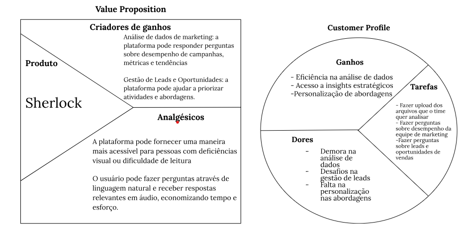

## Matriz de Risco

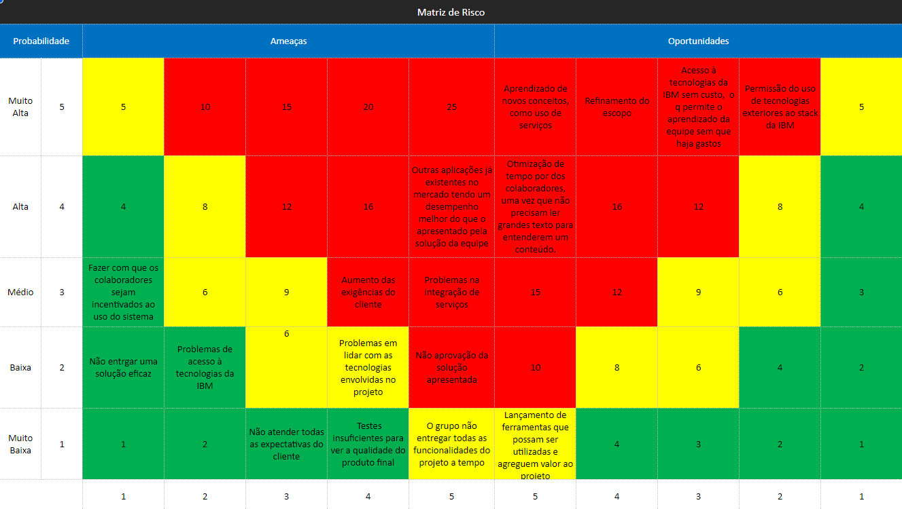

## Análise financeira do projeto

A seguinte análise financeira para o projeto até a entrega da primeira Sprint se baseia em custeamento de produtos do IBM cloud que seriam utilizados na arquitetura estipulada até então, de acordo com os requisitos estabelecidos.

- **Speech to Text (Plano Pro):**
  Serviço que converte a fala em texto. O plano Pro tem um custo de US$ 892,80 por mês e cobra uma taxa de $0,02 por minuto de áudio processado.

- **Watson Assistant (Plano Enterprise):**
  Plataforma de chatbot e assistente virtual. O plano Enterprise tem um custo de US$ 6.090,00 por mês e oferece uma instância que suporta até 1000 MAUs (Usuários Ativos Mensais).

- **Cloudant (Plano Standard):**
  Serviço de banco de dados NoSQL. O plano Standard tem um custo mensal de US$ 86,20, com um uso adicional cobrado a $1,15 por GB por mês.

- **Watson Machine Learning (Plano Lite):**
  Esse é um plano gratuito que oferece recursos de aprendizado de máquina da IBM.

- **Text to Speech (Plano Standard):**
  Converte texto em fala. O plano Standard tem um custo mensal de US$ 80,00 e permite 4000 caracteres por usuário (até 1000 usuários), com uma taxa de $0,02 por mil caracteres processados.

- **Natural Language Understanding (Plano Lite):**
  Esse plano gratuito oferece recursos de processamento de linguagem natural da IBM para análise e extração de informações de texto.

**Para uma melhor visualização:**

| Produto                        | Plano            | Preço por Mês | Detalhes                                             |
| ------------------------------ | ---------------- | ------------- | ---------------------------------------------------- |
| Speech to Text                 | Plano Pro        | US$ 892,80    | $0,02 por minuto                                     |
| Watson Assistant               | Plano Enterprise | US$ 6.090,00  | 1 instância para 1000 MAUs (Usuários Ativos Mensais) |
| Cloudant                       | Plano Standard   | US$ 86,20     | Uso adicional: $1,15 por GB por mês                  |
| Watson Machine Learning        | Plano Lite       | Sem custo     |                                                      |
| Text to Speech                 | Plano Standard   | US$ 80,00     | 4000 caracteres por usuário (para 1000 usuários)     |
| Natural Language Understanding | Plano Lite       | Sem custo     |                                                      |

Tais produtos estão sujeitos a futuras alterações de acordo com o desenvolvimento e melhor entendimento do escopo do projeto.

# Entendimento do Design (Sprint 1)

## Persona

A persona é uma representação detalhada de um público-alvo específico, criada com base em dados reais e características demográficas, psicográficas e comportamentais. O objetivo principal da nossa persona é entender melhor as necessidades, desejos, motivações e preferências dos usuários da nossa aplicação.


## Mapeamento do processo

Para fazer um bom estudo do mapeamento de processo do usuário, decidimos usar o método do mapa da jornada do usuário.

O mapa de jornada do usuário é uma representação visual que ilustra a experiência completa de um usuário ao interagir com um produto, serviço ou sistema, desde o momento em que ele toma conhecimento até o término da sua interação. Ele é usado para mapear todas as etapas pelas quais um usuário passa, suas ações, emoções, pontos de contato e necessidades ao longo desse percurso.

O objetivo principal do mapa de jornada do usuário é oferecer uma compreensão detalhada das interações entre o usuário e a solução, permitindo identificar oportunidades de melhorias e otimizações. Ele ajuda as equipes de design, desenvolvimento e marketing a obterem insights sobre como proporcionar uma experiência mais satisfatória e eficaz para os usuários, além de identificar possíveis pontos problemáticos que precisam ser abordados.

Ao criar um mapa de jornada do usuário, os profissionais podem visualizar de forma clara os momentos-chave da interação, as emoções do usuário em cada etapa, as motivações que os impulsionam e as possíveis barreiras que enfrentam. Com base nessas informações, as equipes podem ajustar seus processos e estratégias para criar produtos e serviços mais alinhados com as necessidades e expectativas dos usuários, resultando em uma experiência mais positiva e gratificante.

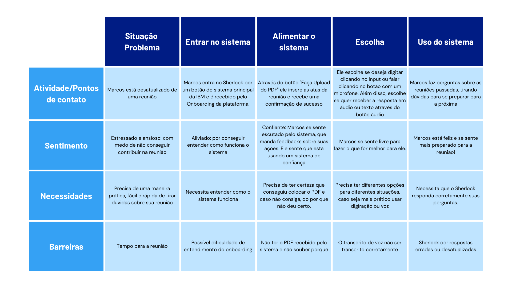

Fonte: elaborado pelo autor (2023).

## Proposta de UX para o sistema

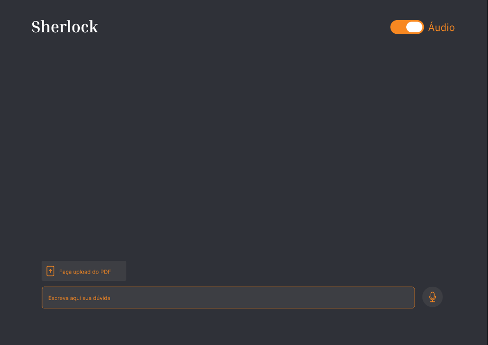
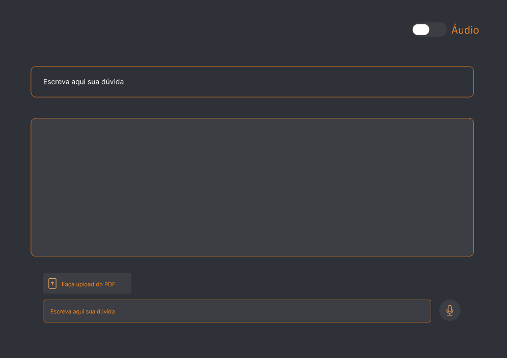

## Pilha de tecnologias para implementar a proposta de UX

### Versão 1 da pilha de tecnologias:

#### Frontend

- Framework JavaScript: NextJS ou ReactJS
- CSS Framework: Sass

#### Backend

- Node.js ou NestJS: A escolha foi feita uma vez que o grupo já tem familiaridade com frameworks de JavaScript.

#### Banco de Dados

- Cloudant: Dado que estamos hospedando na IBM Cloud, o Cloudant é uma opção adequada para um banco de dados escalável e gerenciado.

#### Processamento de Linguagem Natural (NLP)

- Watson Assistant: Usaremos o Watson Assistant da IBM para implementar as funcionalidades de processamento de linguagem natural e interpretação de perguntas dos usuários.

#### Hospedagem e Infraestrutura

- IBM Cloud: Visto a parceria feita, a infraestrutura de nuvem da IBM é apropriada para hospedar o sistema, garantindo disponibilidade e escalabilidade.

#### Testes e Performance

- Apache JMeter: Para testar a escalabilidade e o desempenho do sistema com múltiplos usuários, o Apache JMeter é uma escolha comum.

#### Segurança

- Autenticação e Autorização: Vamos implementar a autenticação de usuários IBM usando um sistema com JWT (JSON Web Tokens).
- Test-Driven Development (TDD): Usaremos o TDD para testar funcionalidades de segurança, garantindo que apenas usuários autorizados possam acessar a plataforma.

#### Conformidade Legal

- GDPR e Proteção de Dados: Iremos nos certificar de que o sistema esteja em conformidade com as leis de proteção de dados, especialmente o GDPR.

#### Desenvolvimento e Manutenção

- TypeScript: Usaremos ele para desenvolver tanto o frontend quanto o backend, melhorando a qualidade e a manutenção do código.

# Entendimento da Arquitetura do Sistema (Sprint 1)

## Versão 1 da arquitetura do sistema

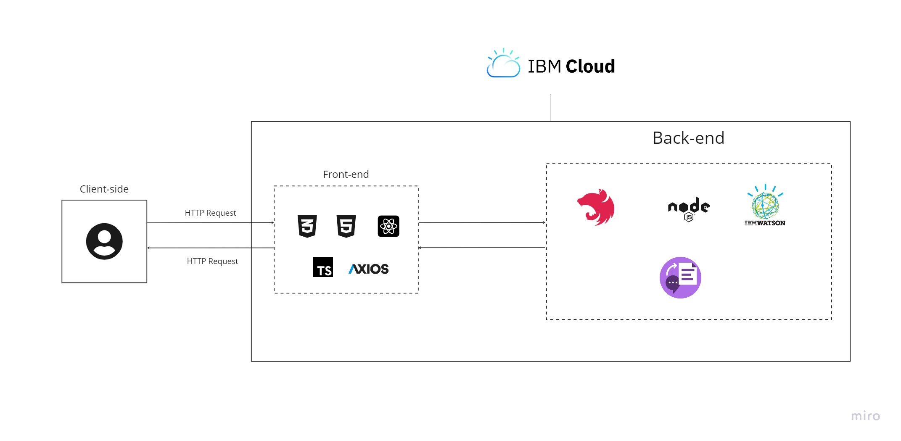

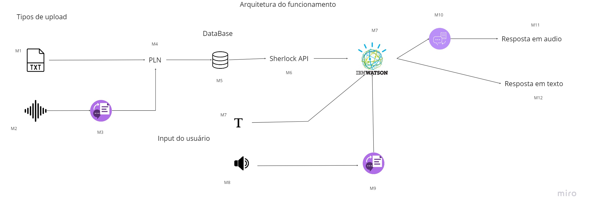

Legenda dos módulos do sistema:

- M1: Upload de arquivo em texto</br>
- M2: Upload de arquivo em áudio</br>
- M3: Serviço de Speech-to-Text da IBM</br>
- M4: Processamento de linguagem natural</br>
- M5: Banco de dados da aplicação</br>
- M6: API criada pelo grupo</br>
- M7: Serviço IBM Watson</br>
- M8: Input do usuário em formato de texto</br>
- M9: Input do usuário em forma de áudio</br>
- M10: Serviço de Speech-to -Text da IBM</br>
- M11: Serviço de Text-to-Speech da IBM</br>
- M12: Resposta para o usuário em áudio</br>
- M13: Resposta para o usuário em texto

Relacionamento dos requisitos com os módulos do sistema:

[Funcionais](#requisitos-funcionais)

- RF1: M2</br>
- RF2: M1</br>
- RF3: M11 & M12</br>
- RF4: M11</br>
- RF5: M12</br>
- RF6: M7</br>
- RF7: M3 & M9</br>
- RF8: M6 & M7</br>
- RF9: M10

[Não Funcionais](#requisitos-não-funcionais)</br>

- RNF1: M6 & M7</br>
- RNF2: M1 & M2 & M7 & M8 & M11 & M12</br>
- RNF3: M6</br>
- RNF4: M6</br>
- RNF5: M6</br>
- RNF6: Todos os módulos</br>
- RNF7: M6

[Link par o miro com as arquiteturas](https://miro.com/app/board/uXjVMvYJOCA=/)

# Documentação do Sistema NLP (Sprint 2)

## API para implementar etapa de Speech to Text

API para implementar a etapa de Speech to Text: Essa seção da documentação deve detalhar a API necessária para implementar a etapa de conversão de áudio em texto (Speech to Text). Ela deve fornecer informações sobre os endpoints disponíveis, os métodos HTTP aceitos, os parâmetros de entrada necessários e as respostas esperadas. Além disso, é importante fornecer exemplos claros de como fazer chamadas à API, incluindo exemplos de requisição e resposta.

Foram realizados testes em três endpoints no Postman:

1 - Endpoint "Post para usar o serviço": Este endpoint tem o objetivo de testar o serviço de speech-to-text fornecido pela IBM usando o método POST do HTTP. Como parâmetro, espera-se a autorização do tipo "Basic Auth" com o nome de usuário e a senha do serviço criado na IBM Cloud. Outro parâmetro esperado é um arquivo do tipo ".flac" (faça o download do arquivo de áudio da amostra: https://watson-developer-cloud.github.io/doc-tutorial-downloads/speech-to-text/audio-file.flac), que deve ser passado no corpo da requisição na opção "binary" do Postman. Esse arquivo deve conter áudio na língua inglesa. A saída esperada é o áudio transcrito para texto em inglês (texto esperado: "several tornadoes touch down as a line of severe thunderstorms swept through Colorado on Sunday "). Para chamar esse endpoint, basta colar a URL "https://api.au-syd.speech-to-text.watson.cloud.ibm.com/instances/79c31f7c-f2b7-40fc-979a-e9e58205bc09/v1/recognize" obtida no serviço de speech to text da IBM (documentação oficial: https://cloud.ibm.com/services/speech-to-textcrn%3Av1%3Abluemix%3Apublic%3Aspeech-to-text%3Aau-syd%3Aa%2Fc054a0ea54f24abd84c6188262eb3e1c%3Ad4026feb-be36-4d05-84fd-b994850c7145%3A%3A?paneId=gettingStarted), selecionar o método POST no Postman e passar os parâmetros mencionados anteriormente.

2 - Endpoint "Get para pegar URL em português": Este endpoint tem o objetivo de obter a URL do serviço de speech-to-text que aceita áudios em português, usando o método GET do HTTP. Como parâmetro, espera-se a autorização do tipo "Basic Auth" com o nome de usuário e a senha do serviço criado na IBM Cloud. A saída esperada é um array de objetos, cada um responsável por um idioma diferente. O objeto escolhido deve ser o "pt-BR_BroadbandModel", que aceita áudios em português. Dentro desse objeto, é fornecida a chave-valor "url", que será usada para fazer a transcrição em português. Para chamar esse endpoint, basta colar a URL "https://api.au-syd.speech-to-text.watson.cloud.ibm.com/instances/79c31f7c-f2b7-40fc-979a-e9e58205bc09/v1/models", selecionar o método GET no Postman e passar os parâmetros mencionados anteriormente.

3 - Endpoint "Post para usar o speech_to_text em português": Este endpoint tem o objetivo de testar o serviço de speech-to-text que aceita áudios em português, usando o método POST do HTTP. Como parâmetro, espera-se a autorização do tipo "Basic Auth" com o nome de usuário e a senha do serviço criado na IBM Cloud. Outro parâmetro esperado é um arquivo do tipo "flac" (faça o download do arquivo de áudio da amostra:https://gitlab.com/fb-audio-corpora/constituicao16k/-/tree/master?ref_type=heads), que deve ser passado no corpo da requisição na opção "binary" do Postman. Esse arquivo deve conter áudio na língua portuguesa. A saída esperada é o áudio transcrito para texto em português (texto esperado: "a república federativa do brasil formada pela união indissolúvel dos estados e municicípios ..." ). Para chamar esse endpoint, basta colar a URL "https://api.au-syd.speech-to-text.watson.cloud.ibm.com/instances/79c31f7c-f2b7-40fc-979a-e9e58205bc09/v1/models/pt-BR_BroadbandModel/recognize" obtida no serviço de speech to text da IBM (documentação oficial: https://cloud.ibm.com/services/speech-to-textcrn%3Av1%3Abluemix%3Apublic%3Aspeech-to-text%3Aau-syd%3Aa%2Fc054a0ea54f24abd84c6188262eb3e1c%3Ad4026feb-be36-4d05-84fd-b994850c7145%3A%3A?paneId=gettingStarted), selecionar o método POST no Postman e passar os parâmetros mencionados anteriormente.

Essa parte foi apenas realizado testes no Postman, ou seja, não possui código, pois a API do serviço já está pronta. 

Os testes estão documentados em: tests/index.md

## Algoritmo de NLP utilizado e sua implementação

### Sobre

<p> Um algoritmo de Processamento de Linguagem Natural (NLP) é um conjunto de instruções computacionais projetadas para lidar com texto e linguagem humana de maneira automatizada. Ele é desenvolvido para entender, interpretar, analisar ou gerar linguagem natural, permitindo que computadores possam interagir com dados textuais de maneira similar a como os seres humanos o fazem. </p>

### Finalidade e benefícios

<p>Na finalidade do nosso projeto, ele tem o objetivo de entender a intenção do usuário em seu pedido para que ele consiga rastrear exatamente o que ele deseja no PDF que foi feito o upload. Como benefícios, trazemos a melhor experiência no prompt de comando e a eficiência nas respostas.
</p>

### Frameworks e bibliotecas

<p> Para fazer esse algoritmo, usamos bibliotecas como spacy e nltk, que oferecem uma ampla gama de recursos para lidar com tarefas relacionadas a NLP. Além de sklearn para análise de similaridade de cosseno e numpy e matplotlib para visualizar gráficos.</p>

### Etapas

Durante todo o notebook, utilizamos e explicamos as etapas de processamento: Lemmatização, Tokenização, Stopwords, Similaridade de Cosseno.

### Acesso

<p> Para acessar o notebook, basta clicar na frase "Link de acesso" abaixo. </p>
<a href="https://colab.research.google.com/drive/1w74Zi1Kg1c_O7hjxc4iNFLlG48G1_AeY?usp=sharing">Link de acesso</a>

O código e os testes forma implementados no mesmo arquivo e estão na pasta src/backend/NLP.

Os testes estão documentados em: tests/index.md


## Processo de deploy do algoritmo em nuvem comercial

A seguir está descrito o processo de deploy da aplicação PLN. A aplicação em questão está em um google colab e será passada para o flask para implementação. Para esse deploy, serão utilizados os serviços da AWS, mais especificamente uma instância EC2, por meio do docker.
Primeiramente, é necessário criar o arquivo ‘Dockerfile’ que vai determinar como a aplicação deverá funcionar quando for iniciado um novo servidor que contenha a aplicação. O arquivo fica da seguinte forma:

```
#sevidor rodará em node 18, na versão alpine que é uma versão mais leve do node
FROM node:18-alpine

#criando diretório de trabalho
WORKDIR /usr/src/app

#copiando o package.json para o diretório de trabalho
COPY package*.json ./

#instalando as dependências
RUN npm install

#copiando o resto dos arquivos para o diretório de trabalho
COPY . .

#expondo a porta 3000
EXPOSE 3000

#rodando o comando npm start
CMD [ "npm", "start" ]
```
Para poder rodar a aplicação, será necessário criar um arquivo chamado ‘docker-compose.yml’, que fica da seguinte forma:

```
# Dockerfile for Flask Application
version: '3'

# Services to be created for the application
services:
  web:
    build: .

    # Expose port 3000 to the host
    ports:
      - "3000:3000"

    # Run the command to start the application
    command: flask run --host=
    
    volumes:
      - .:/code
    environment:
      - FLASK_ENV=development
      - FLASK_APP=app.py
    depends_on:
      - db
  db:
    image: postgres:latest
    environment:
      - POSTGRES_USER=postgres
      - POSTGRES_PASSWORD=postgres
      - POSTGRES_DB=postgres
    volumes:
      - ./data:/var/lib/postgresql/data
```

Uma vez que são criados, é possível rodar a aplicação pelo docker por meio do terminal, já na pasta do projeto, executamos o comando: ```docker-compose up```

Depois do processo de preparação do docker, é necessário criar o servidor de deploy na AWS. Para facilitar o processo de criação e gerenciamento do mesmo, será utilizada a interface de linha de comando na AWS (aws-cli) para acessar seus recursos por meio do próprio terminal. Para instalar esse software, é necessário acessar o github deles (https://github.com/aws/aws-cli) e seguir o processo de instalação. Feito isso, já é possível acessar a linha de comando da AWS.
O próximo passo é configurar o cli rodando o comando: aws configure, que ao ser executado irá pedir a chave de acesso do usuário que pode ser acessada por meio do console da AWS indo nas credenciais de segurança do seu usuário.

Depois de configurado, já é possível criar uma instância EC2 na AWS. Para criar por meio do docker, é necessário instalar também o docker-machine (os passos de instalação podem ser encontrados em https://gdevillele.github.io/machine/install-machine/). O docker-machine cria o servidor automaticamente e instala o docker no servidor, dando todas as permissões e rotas necessárias. Além disso, é possível executar os comandos do docker-machine diretamente pelo servidor, sem necessidade de acesso ssh. Para isso, executa-se o comando: ```docker-machine create –driver amazonec2 <nome da instância>```

Para poder executar os comandos do docker dentro da máquina criada, utiliza-se o comando: ```eval $(docker-machine env <nome da instância>)```. Com isso, todos os comandos do docker vão ser executados dentro da EC2 criada e não mais na máquina local, portanto já é possível executar a aplicação dentro da máquina criada por meio do comando: ```docker-compose up -d```

Agora que a aplicação foi executada, é necessário acessar o security group da instância no console da AWS e liberar o acesso da porta 3000, adicionando uma nova Inbound Rule da seguinte maneira:


Agora já é possível acessar a aplicação por meio do ipv4 público (utilizando a porta indicada) fornecido na descrição da instância no console da AWS


## API para receber os áudios enviados pelo usuário


A API que recebe os aúdios enviados pelo usuário foi desenvolvida em conjundo com [API para implementar etapa de Speech to Text](#api-para-implementar-etapa-de-speech-to-text) descrita no primeiro ponto. Para enviar os um áudio, chamamos o endpoint "/transcriptAudio" fazendo uma requisição POST:

```
router.post('/transcriptAudio', transcriptController.transcriptAudio);
```

Que por sua vez chama o controller descrito abaixo:

```
exports.transcriptAudio = async (req, res) => {
  const audioData = req.body;

  try {
    const apiKey = process.env.IBM_API_KEY;
    const url = process.env.IBM_API_URL;

    const response = await axios.post(url, audioData, {
      headers: {
        "Content-Type": "audio/x-flac",
        Authorization: `Basic ${apiKey}`,
      },
    });

    const transcript = response.data.results[0].alternatives[0].transcript;

    res.send(transcript);
  } catch (error) {
    console.error(error);
    res.status(500).send(error);
  }
};

```

Esse controller recebe áudios no formato FLAC e retorna o texto transcrito.

Como descrito na linha 9 do no index.js, além dos áudios precisarem ser no formato x-Flac. Há um limite de tamanho de 10mb:

```
app.use(bodyParser.raw({ type: "audio/x-flac", limit: "10mb" }));
```
O código descrito está na pasta src/speech-to-text-api.

Com relação aos testes realizados, usamos o postman para testar a API. O arquivo com os testes está na pasta tests.

# Documentação da Construção do Backend da Solução (Sprint 3)

## Integração do Backend ao Serviço de Text to Speech utilizando Webhook

Para integrar o backend ao serviço de text-to-speech foi usado o conceito de webhooks.

Em primeiro lugar foi criado um endpoint no arquivo textToSpeech.controller.ts para mandar o texto do backend até o serviço de text to speech, como mostra o código abaixo:

```
    @Post('sendText')
    async sendText(@Body() dataText: string) {
        const response = await this.textToSpeechService.sendText(dataText);
        const hooks = this.webhookService.sendTextHooks();
        return response;
    }
```
Nesse código é passado um texto no body da requisição, a função "sendText" tem como objetivo enviar a requisição para a api de text to speech, como mostrado no código abaixo:

``` 
@Injectable()
export class TextToSpeechService {
    // lógica para enviar o texto para o serviço de text to speech
    async sendText(dataText: string): Promise<any> {
        const urlReceiveText = 'http://localhost:3030/api/transcriptText';
        try {
            const response = await axios.post(urlReceiveText, { data: dataText });
            return response.data;
        } catch (error) {
            throw new Error('Erro ao enviar o texto para a API de text to speech');
        }
    }
}
```

E a função "sendTextHooks"  tem como objetivo gerenciar os eventos de webhook. Ela cria uma instância da classe webhooks e configura um webhook chamado 'callback_hook'. Quando esse webhook é acionado, ele enviará dados para http://localhost:3030/api/receiveTextWebhook. A instância do webhooks permite configurar, adicionar gatilhos (hooks) e gerenciar a execução de ações quando esses gatilhos são ativados. Veja o código abaixo.

```
import { Injectable } from '@nestjs/common';
const webhooks = require('node-webhooks');

// webhook para enviar o texto para o endpoint receiveTextWebhook
@Injectable()
export class WebhookService {
    sendTextHooks() {
        return new webhooks({
            db: { 'callback_hook': ['http://localhost:3030/api/receiveTextWebhook'] }
        });
    }
}
```
Todos os códigos mostrado acima estão em src/backend/src

Após a criação desse controller no backend, o texto enviado no corpo da requisição deve chegar até o endpoint http://localhost:3030/api/receiveTextWebhook que está localizado em src/text-to-speech/controller. 

Endpoint receiveTextWebhook :

```
exports.transcriptText = async (req, res) => {
    try {
        // mostra o texto passado no body do sendText vindo do back
        console.log('Inside Callback hook', req.body)
        const inputText = req.body.data.text;
        if (!inputText) {
            return res.status(400).json({ error: 'Texto não fornecido na solicitação.' });
        }
        const audioBuffer = await textToSpeechService.synthesizeText(inputText);
        const hooks = await textToSpeechService.sendBufferHooks();
        res.setHeader('Content-Type', 'audio/mpeg');
        res.status(200).send(audioBuffer);
    }
    catch (err) {
        console.error('Erro:', err);
        res.status(500).json({ error: 'Ocorreu um erro durante a síntese de texto.' });
    }
}
```

A função synthesizeText pega o texto recebido do backend e o transforma para base 64, veja no código abaixo:

```
    async synthesizeText(inputText) {

        const apiKey = process.env.IBM_API_KEY;
        const serviceUrl = process.env.IBM_API_URL;

        const textToSpeech = new TextToSpeechV1({
            authenticator: new IamAuthenticator({
                apikey: apiKey,
            }),
            serviceUrl: serviceUrl,
        });

        console.log("Setting parameters...");
        const synthesizeParams = {
            text: inputText,
            accept: 'audio/mpeg',
            voice: 'pt-BR_IsabelaV3Voice',
        };

        try {
            console.log("Synthesizing...");
            const response = await textToSpeech.synthesize(synthesizeParams);

            const repairBuffer = await new Promise((resolve, reject) => {
                const chunks = [];
                response.result.on('data', (chunk) => {
                    chunks.push(chunk);
                });
                response.result.on('end', () => {
                    resolve(Buffer.concat(chunks));
                });
                response.result.on('error', reject);
            });

            const webhookURL = "http://localhost:3000/testToSpeech/receiveBuffer";
            const base64Buffer = repairBuffer.toString('base64');
            const data = {
                "buffer": base64Buffer
            };
            console.log(base64Buffer)

            try {
                const response = await axios.post(webhookURL, data);
                console.log("Webhook enviado com sucesso:", data);
            } catch (error) {
                console.error("Erro ao enviar o webhook:", error);
            }
            return repairBuffer;
        } catch (err) {
            console.log('error: ', err);
        }
    }
```

Após transformar o texto para base64 é necessário retornar essa informação obtida para o backend. E a função sendBufferHooks é responsável por administrar os eventos. Essa integração também foi feita por webhook, veja o código da função sendBufferHooks abaixo:

```
    async sendBufferHooks() {
        return new webhooks({
            db: { 'callback_hook': ['http://localhost:3000/testToSpeech/receiveBuffer'] }
        });
    }
```

A resposta deve chegar ao endpoint http://localhost:3000/testToSpeech/receiveBuffer que está localizado em src/backend/src/controller/textToSpeech/textToSpeech.controller.ts. O código do endpoint está abaixo.

```
    @Post('receiveBuffer')
    async receiveBuffer(@Body() dataBuffer: any, @Res() res: Response) {
        try {
            console.log('Inside Callback hook', dataBuffer);
            return res.status(HttpStatus.OK).json({ success: true, data: dataBuffer });
        } catch (error) {
            throw new Error('Erro ao receber o buffer da API de text to speech');
        }
    }
```

A documentação dos testes estão em: projeto1/tests/index.md.

## Um sistema de troca de mensagens para notificar os eventos

### Descrição do sistema de mensageria

Para o sistema de troca de mensagens decidimos por utilizar o Apache Kafka, que é uma plataforma de streaming distribuída de código aberto que permite a publicação e a subscrição de fluxos de registros em tempo real. Ele é projetado para ser rápido, escalável e durável. O uso do kafka em nossa aplicação permitirá a disponibilidade da aplicação mesmo em momentos de alto uso, além de permitir que a aplicação seja escalável. 

O uso do Kafka em nossa aplicação se deu por meio da impletação dele via Docker. Para isso, foi necessário criar um arquivo chamado <i><b>docker-compose.yml</b></i>, que contém as configurações necessárias para a criação de um container do Kafka. Decidimos por usar a imagem do Kafka desenvolvida pela Confluent Inc pois ela já vem com o Zookeeper, que é um serviço de gerenciamento de configuração, sincronização e nomeação distribuída, que é necessário para o funcionamento do Kafka. Além disso, a imagem da Confluent Inc já vem com o Control-Center, que é uma interface gráfica para gerenciar e monitorar o Kafka.

Em nossa arquitetura temos inicialmente dois tópicos, um chamado de <i><b>client-producer-topic</b></i> e um chamado de result <i><b>result</b></i>. O nosso backend principal está inscrito no tópico <i><b>result</b></i> e pública mensagens no <i><b>client-producer-topic</b></i>. Já o nosso microserviço realiza o contrário, ou seja, ele está inscrito no <i><b>client-producer-topic</b></i> e pública mensagens no <i><b>result</b></i>.

Dito isso, temos um fluxo que segue a seguinte lógica: o usuário faz o upload de um arquivo de áudio no frontend, que por sua vez chama uma rota no backend que é chamada sempre que o usuário deseja transformar um áudio em texto. Trata-se de uma requisição POST, na qual o usuário passa o áudio que deve ser transcrito. A partir do momento que o backend recebe esse áudio, ele pública uma mensagem no tópico <i><b>client-producer-topic</b></i> do Kafka. Essa mensagem contém o buffer do áudio que o usuário deseja transcrever.

Em paralelo, temos o nosso serviço de speech to text rodando. Tal serviço está inscrito no memsmo tópico <i><b>client-producer-topic</b></i>, ou seja, assim que o backend da aplicação publica uma mensagem nesse tópico, o serviço de speech to text recebe essa mensagem e a processa. Esse processamento nada mais é do que o consumo da API de speech to text da IBM, que recebe o buffer do áudio e retorna o texto transcrito(como desenvolvido na sprint 2). Após o processamento, o serviço de speech to text publica uma mensagem no segundo tópico, <i><b>result</b></i>, que contém o texto transcrito.

Em seguida, o backend da aplicação recebe essa mensagem e a envia para o frontend, que por sua vez exibe o texto transcrito para o usuário.

Abaixo segue o setup producer e do consumer do backend da aplicação:

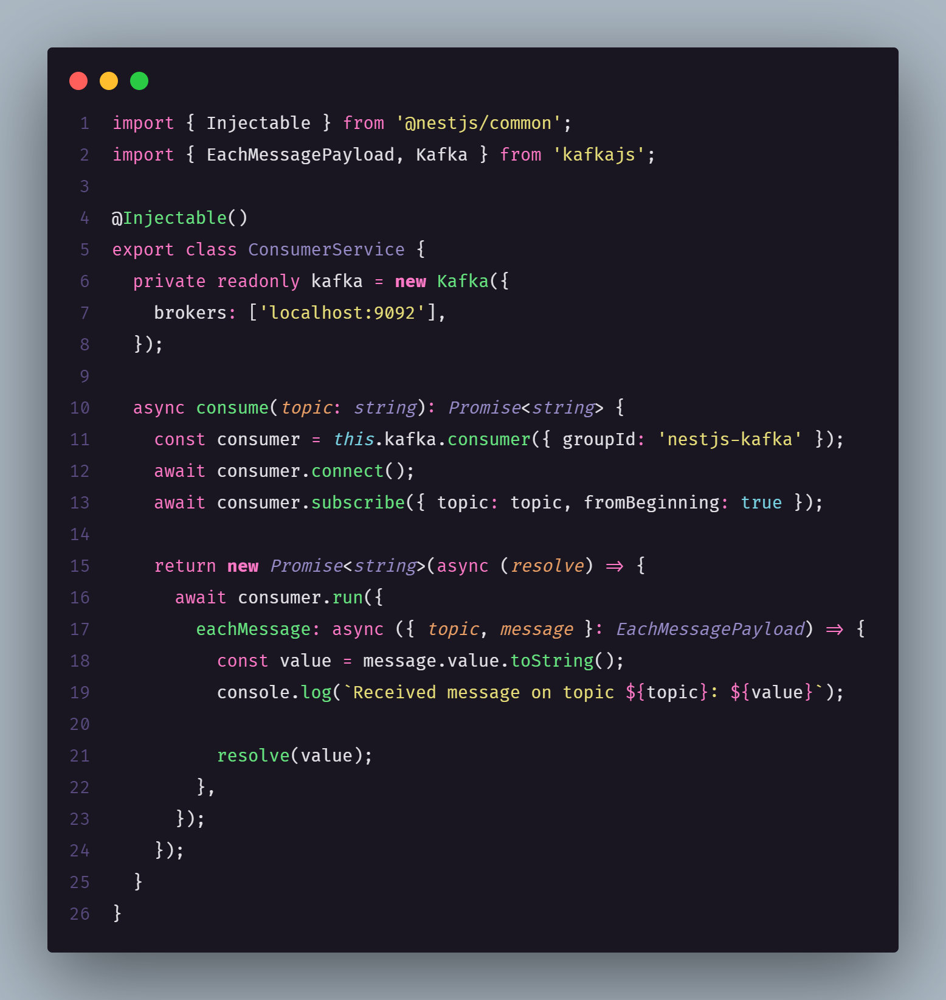
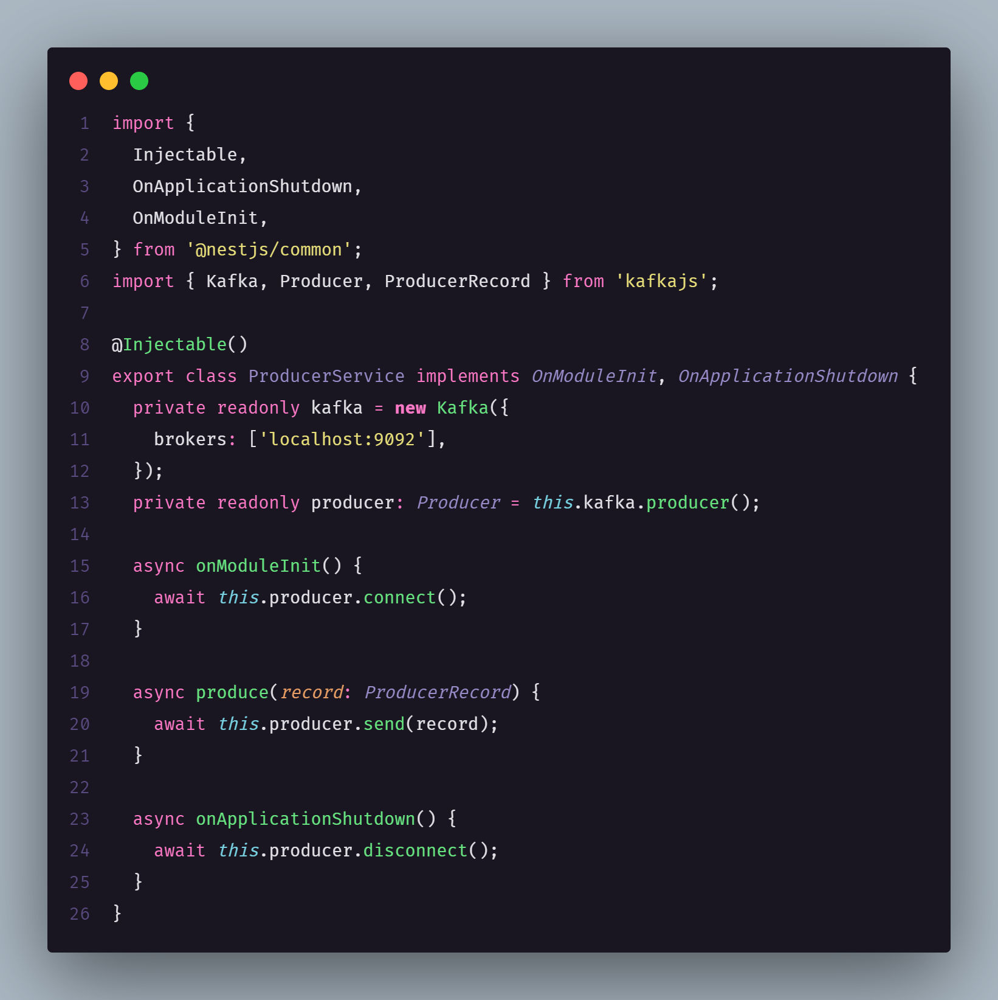

Da mesma forma, segue o setup producer e do consumer do serviço de speech to text:

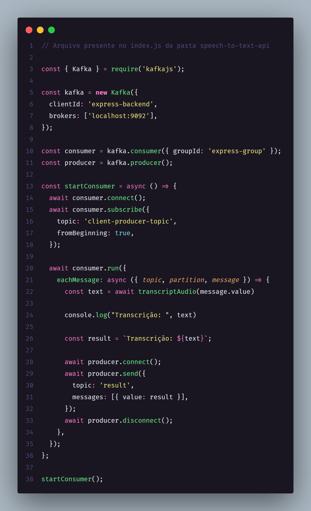

### Testes mensageria

Ao rodar o o kafka temos um frontend da confluent que permite a visualização dos tópicos e das mensagens que estão sendo enviadas. Abaixo segue a imagem do frontend da confluent:

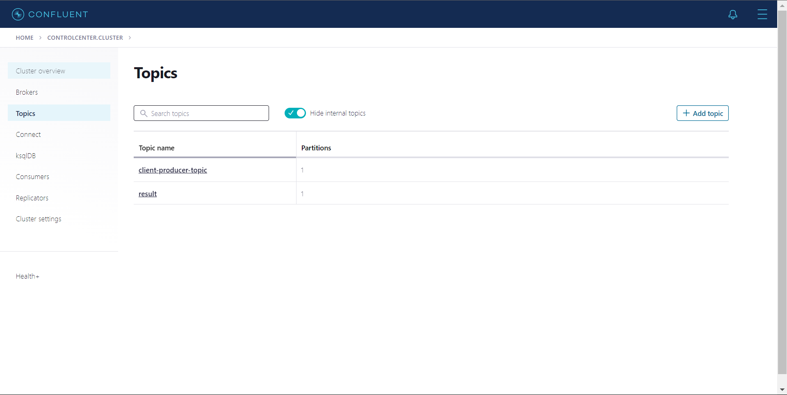

Agora, segue abaixo duas imagens de uma mensagem sendo enviada de um producer e sendo lida em um segundo topico, ou seja, consumer:

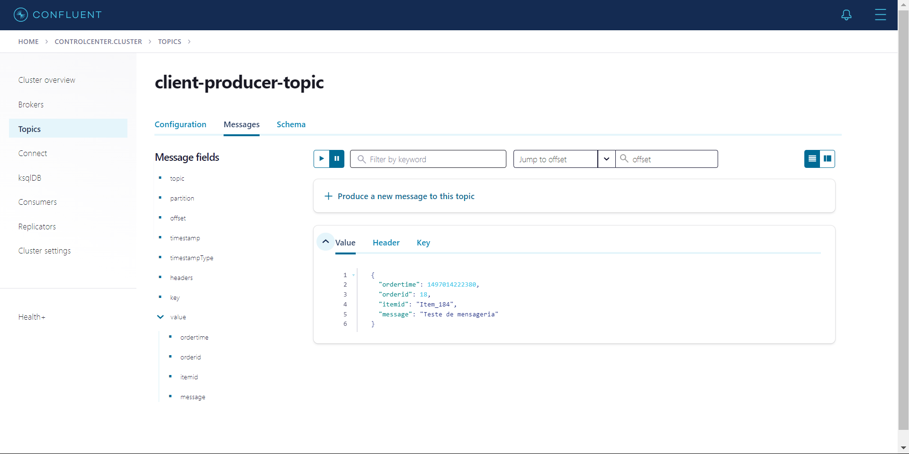

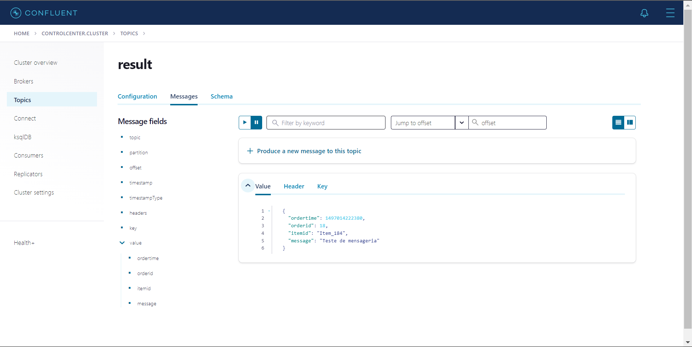

## Frontend Mínimo 

### Descrição da Interface 
Nossa interface foi cuidadosamente projetada com o objetivo de proporcionar uma experiência minimalista e intuitiva aos usuários. O Grupo Holmes escolheu uma interface web como a melhor opção para atender às necessidades de nossos usuários. Para atingir os objetivos da Sprint 3, dedicamos esforços para criar a primeira versão da interface que os usuários utilizarão.

Os principais elementos desta interface incluem um campo de perguntas, onde os usuários podem esclarecer suas dúvidas sobre os documentos em PDF ou áudio, bem como um campo de respostas. O Sherlock, nossa aplicação, gera respostas com base nas perguntas dos usuários e nos materiais de consulta, que incluem o PDF e o arquivo de áudio.

É importante destacar que esta é apenas a versão inicial da nossa interface, e, portanto, ainda existem ajustes a serem feitos. Por exemplo, os botões de upload de arquivos ainda não passaram por estilização, mas, mesmo assim, os arquivos enviados pelos usuários são encaminhados para o backend da aplicação.

Adicionalmente, na primeira versão, já implementamos alguns recursos de feedback para os usuários. O primeiro deles é uma mensagem de erro que é exibida quando o usuário não faz o upload de um arquivo ou quando o Sherlock não consegue compreender a pergunta. No futuro, planejamos segmentar esses feedbacks, um para informar sobre a ausência de um arquivo e outro para comunicar problemas de compreensão por parte da aplicação. O segundo recurso é um indicador de carregamento, que é representado por um ícone triangular de "loading" localizado no canto inferior direito da aplicação."

Por fim, segue abaixo, as imagens da primeira versão da interface do Sherlock: 
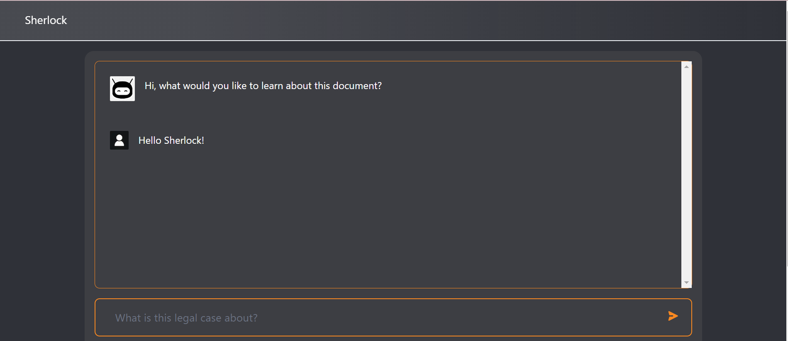
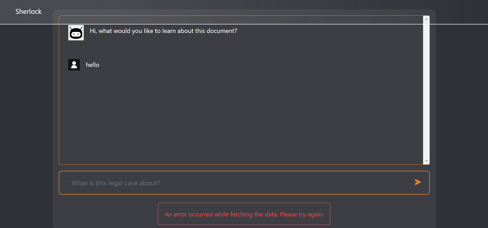

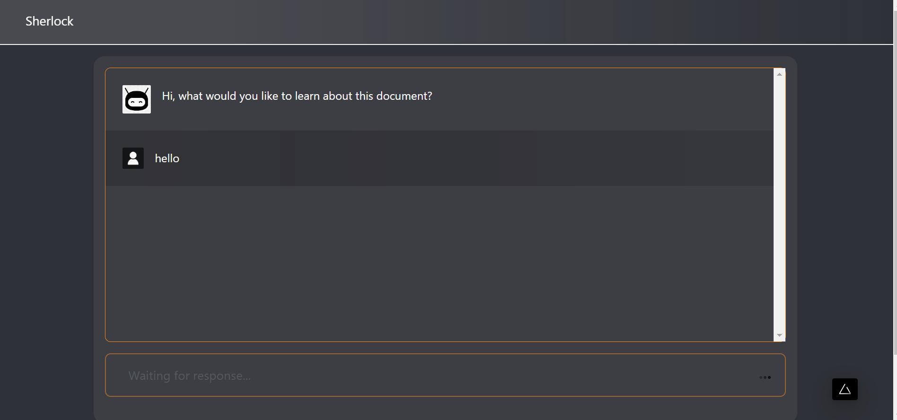
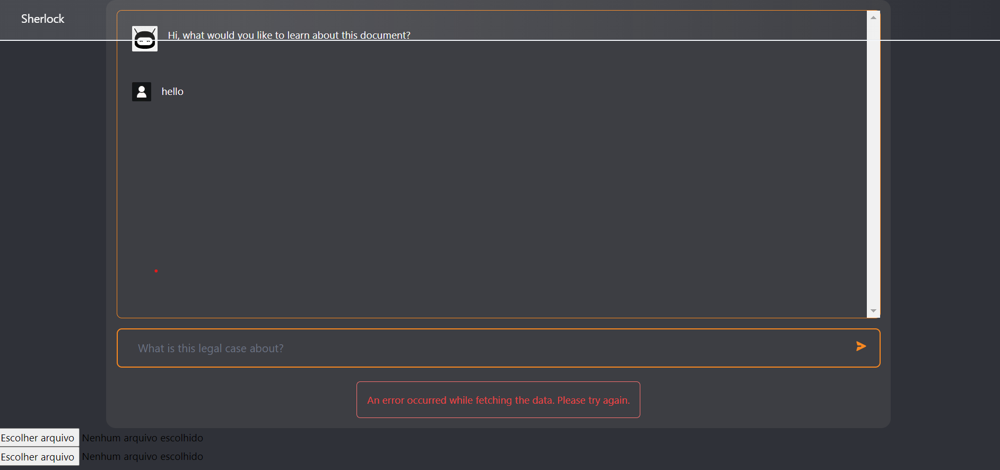
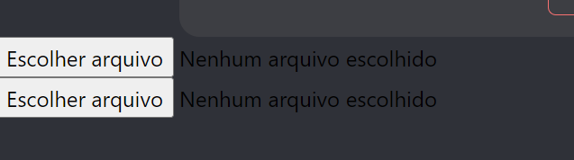

###Integração com as APIs do Backend 


### Instruções de uso e testes
**Passo 1 : Carregue seu Arquivo**

Para iniciar sua jornada com o Sherlock, o usuário deve carregar um arquivo em formato PDF ou de áudio, utilizando os botões correspondentes.

**Passo 2: Formule suas Perguntas**

Após o carregamento do arquivo, o próximo passo é formular as perguntas desejadas. O usuário pode usar o campo de perguntas para digitar suas dúvidas ou, em um futuro próximo, fazer perguntas por meio de um microfone.

**Passo 3: Receba suas Respostas**

Uma vez que as perguntas sejam feitas ao Sherlock, o usuário deverá aguardar o tempo de processamento e, em seguida, receberá as respostas em formato de texto na tela. É importante destacar que, em um futuro próximo, o usuário também terá a opção de receber respostas em formato de áudio.

# Construção do Front-end da Aplicação (Sprint 4)

##  Implementação do front-end com o framework ou biblioteca desejada

### Requisitos funcionais e não funcionais do projeto
Os requisitos funcionais e não funcionais do sistema encontram-se documentados na seção referente à Sprint 01 deste documento.

Assim, com base nos requisitos do sistema, é possível estabelecer correspondências com os elementos da interface do Sherlock. A seguir, veja essas correspondências:

**Upload de Áudio** (RF1):
Elemento de Interface: Botão de upload de áudio.

**Upload de Texto** (RF2):
Elemento de Interface: Botão de upload de texto.

**Resposta** (RF3):
Elemento de Interface: Área de exibição de respostas.

**Resposta por Áudio** (RF4):
Elemento de Interface: Reprodutor de áudio na área de respostas.

**Resposta por Texto** (RF5):
Elemento de Interface: Texto de resposta na área de resposta.

**Fornecer Fonte** (RF6):
Elemento de Interface: Campo de exibição da fonte da informação.

**Processamento de Fala em Texto** (RF7):
Elemento de Interface: Função para ativar o processamento de fala em texto.

**Feedback de Erro** (RF8):
Elemento de Interface: Área de exibição de feedback de erro.

### Wireframes ou protótipos de design
Segue abaixo o protótipo de design do Sherlock:


Esse é o desenho que o grupo Holmes efetuou da aplicação Sherlock durante a Sprint 01. Atualmente, nós estamos trbalhando na codificação desse protótipo. 
### Ambiente de desenvolvimento
Para a criação do frontend, optamos por utilizar o framework Next.js, uma poderosa ferramenta que simplifica o desenvolvimento web com React.

Para executar o projeto em seu ambiente, siga estas etapas:

Certifique-se de que o Node.js está instalado em sua máquina.

No diretório do projeto, abra o terminal e digite o comando ```npm install```. Isso instalará todas as dependências necessárias para o projeto.

Após a conclusão da instalação, você pode iniciar o servidor local com o comando ```npm run dev```. Isso permitirá que você acesse o frontend do projeto em seu próprio computador.

Com esses dois simples comandos, você estará pronto para explorar e trabalhar no frontend em sua própria máquina

### Código fonte do front-end
O código-fonte do frontend está localizado no diretório 'frontend' do projeto
## Testes do front-end implementado

### Plano de Testes 

#### Introdução
O Plano de testes descreve a estratégia de testes que será aplicada no projeto Sherlock. O objetivo deste plano é garantir que a plataforma seja submetida a testes abrangentes para atender aos requisitos de qualidade e funcionais estabelecidos

#### Estratégia de Teste
##### Testes de Unidade
- Objetivo: Garantir que as unidade de código (funções, métodos, classes) funcionem corretamente de forma isolada
- Método: Utilizar framework Jest
- Critérios de Aceitação:  100% de cobertura de código com testes unitários

##### Testes de Integração 
- Objetivo: Verificar a interação correta entre os diferentes componentes do sistema. 
- Método: Testes de integração contínuos durante o desenvolvimento
- Critério de Aceitação: Integração sem problemas entre todos os componentes 

##### Testes de Interface do Usuário 
- Objetivo: garantir a usabilidade e a experiência do usuário 
- Método: testes manuais com base em cenários de uso e casos de teste.
- Critérios de Aceitação: Usabilidade atende aos requisitos e proposta de UX do sistema

##### Testes de Desempenho 
- Objetivo: Avaliar o desempenho do sistema sob carga
- Método: Utilizar a ferramenta Apache JMeter para simular diferentes níveis de carga
- Critérios de Aceitação: O sistema mantém o desempenho e o tempo de resposta dentro dos limites especificados sob carga máxima


### Casos de Teste
Nesta sprint, a equipe Holmes assumiu a responsabilidade de conduzir uma série de testes com o objetivo de assegurar a qualidade e a confiabilidade da aplicação. Esses testes desempenham um papel fundamental na identificação de problemas e na garantia de que o software esteja alinhado com os requisitos do projeto.

Consequentemente, foi essencial criar casos de teste com base nos requisitos do projeto. Estes casos de teste têm como propósito principal a validação do cumprimento dos requisitos especificados e a conformidade com os padrões de qualidade estabelecidos. Eles desempenham um papel crucial na garantia de que o software atenda não apenas às expectativas, mas também aos critérios de qualidade definidos.

##### Caso de teste 01: Upload de Áudio (RF1)
- Entrada Esperada: Arquivo de áudio válido
- Resultado Esperado: O sistema aceita o upload do arquivo de áudio.

##### Caso de teste 02: Upload de Texto (RF2)
- Entrada Esperada: Arquivo de texto válido
- Resultado Esperado: O sistema aceita o upload do arquivo de texto.

##### Caso de teste 03: Obter Resposta (RF3)
- Entrada Esperada: Pergunta do usuário
- Resultado Esperado: O sistema fornece uma resposta relevante à pergunta do usuário.

##### Caso de teste 04: Feedback de erro (RF8)
- Entrada Esperada: Solicitação que resulta em erro
- Resultado Esperada: O sistema fornece feedback sobre o erro.

##### Caso de teste 05: Testes de Usabilidade (RNF2)
- Entrada Esperada: Uso típico do sistema
- Resultado Esperado: Os testadores relatam uma boa experiência de uso com base nos critérios de usabilidade estabelecidos.
##### Caso de Teste 06: Teste de Escalabilidade (RNF3)
- Entrada Esperada: Variação do número de usuários ativos
- Resultado Esperado: O sistema é capaz de dimensionar o armazenamento conforme necessário e atender ao tempo de resposta de 3 segundos para até 300 usuários simultâneos.

##### Caso de Teste 07: Teste de Disponibilidade  (RNF4)
- Entrada Esperada: Monitoramento da disponibilidade do sistema
- Resultado Esperado: O sistema atinge uma disponibilidade de 99,9% ao longo do tempo.
##### Caso de teste 08: Teste de Desempenho (RNF5)
- Entrada Esperada: Interação de usuários reais
- Resultado Esperado: O sistema atende ao requisito de carregamento ágil de 3 segundos para respostas da inteligência artificial.

### Relatório de testes 

Teste de usabilidade realizado em sala de aula com 9 alunos de outras turmas, no dia 18 de setembro, segunda-feira. 
Os alunos receberam uma breve explicação sobre como utilizar a ferramenta Sherlock. Eles foram solicitados a fazer o upload de um arquivo PDF e realizar perguntas sobre o mesmo.
Após a pesquisa, cada aluno foi convidado a preencher um questionário de feedback sobre o uso da nossa aplicação.
Obtivemos os seguintes resultados:


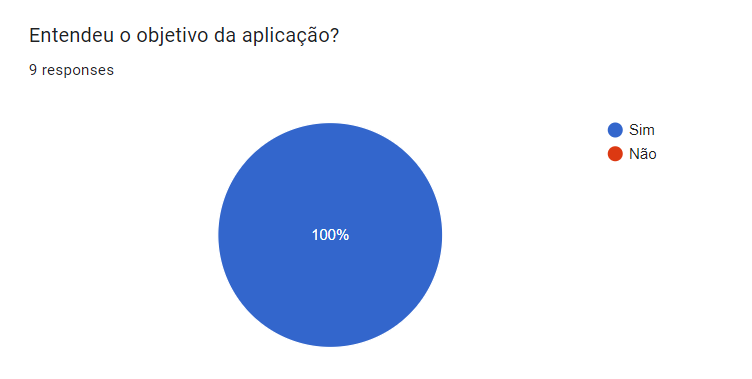
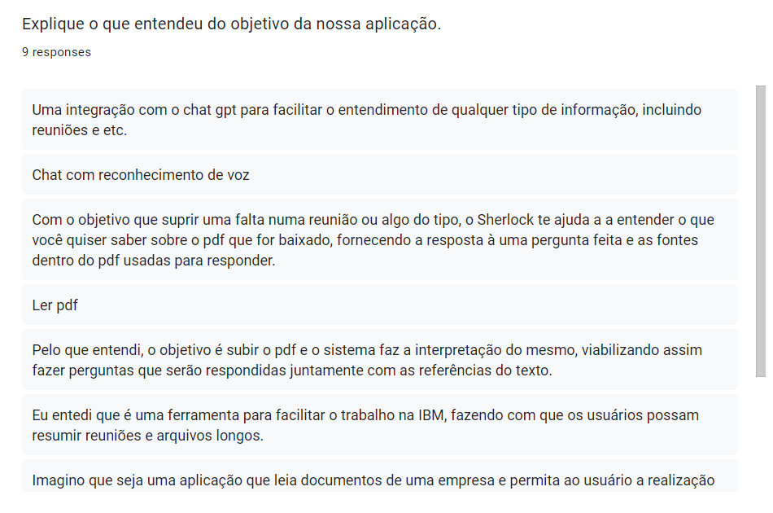
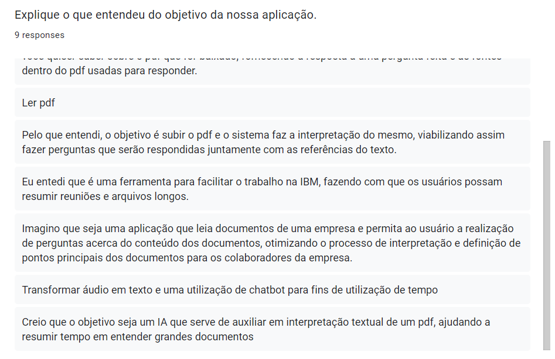
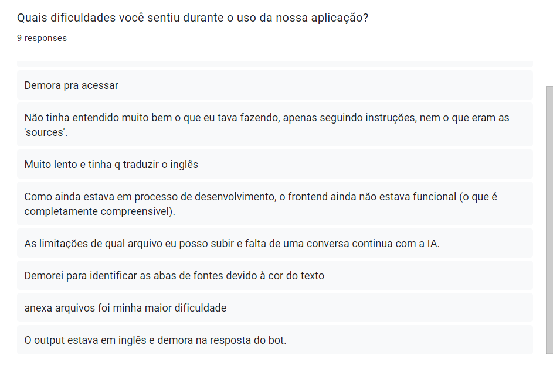
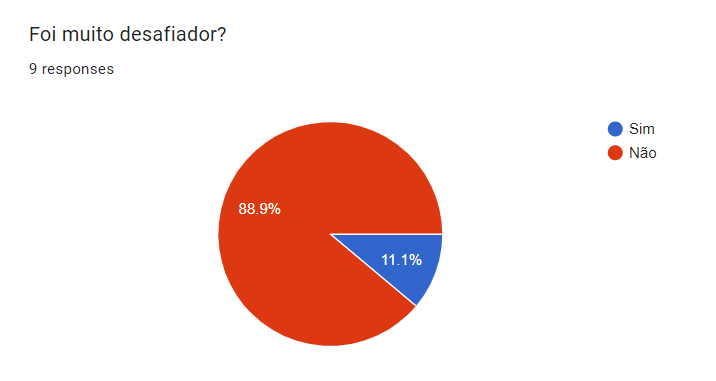

## Integração do frontend com o backend implementado

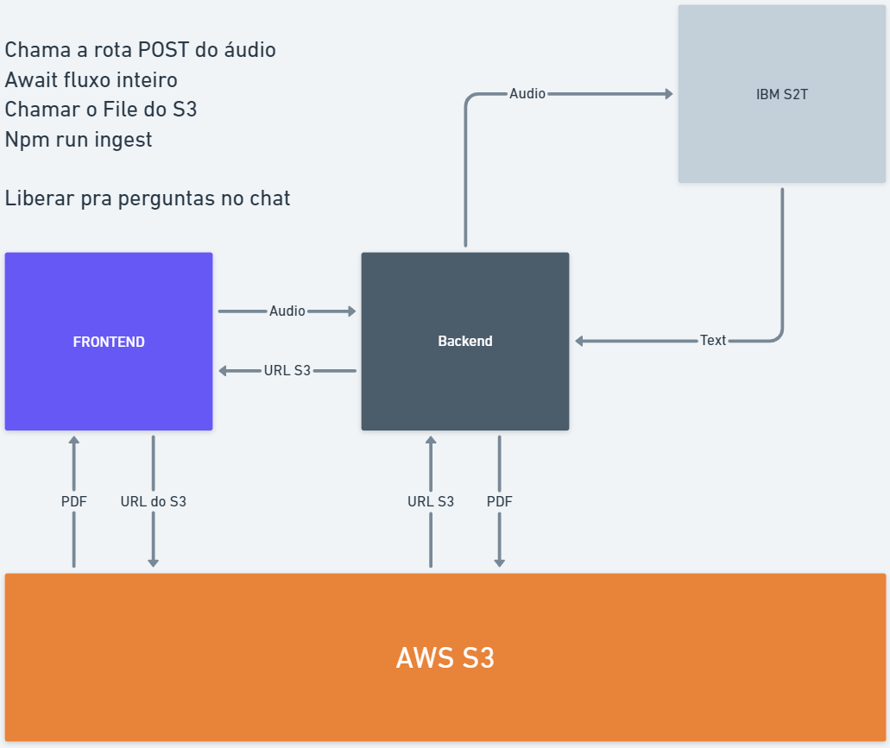

A imagem acima representa a arquitetura do Sherlock. Nela, é possível observar que o frontend se comunica com o backend por meio de uma API REST. Essa API é responsável por receber os arquivos de áudio e texto enviados pelo usuário e encaminhá-los para a API de Speech to Text da IBM.

A partir do retorno da API de Speech to Text, o backend transforma o texto em PDF e o envia para AWS, e após isso devolve o a url do s3 para o frontend.

A partir disso o frontend consome esse pdf com uso da API da OPENAI e retorna a resposta para o usuário.

## Deploy da solução

### Configurações do servidor
Para fazer o deploy de um frontend na Vercel, é necessário seguir os passos abaixo:
**Crie uma Conta na Vercel:**
Acesse o site da Vercel (https://vercel.com/) e clique em "Sign Up" para criar uma conta.

**Faça Login na Vercel:**
Faça o login diretamente no site.

**Crie um Novo Projeto:**
No painel da Vercel, clique em "New Project" e selecione o repositório do seu código-fonte (GitHub).


**Configure as Configurações do Projeto:**
Siga as instruções para configurar o projeto, incluindo a escolha do ambiente (Frontend), o nome do projeto, as configurações de implantação e outras opções específicas.

**Defina as Variáveis de Ambiente:**
 Nessa etapa é necessário adicionar o ```.env``` no campo de variáveis de ambiente 

**Implante o Frontend:**
Depois de configurar todas as opções, você pode implantar o frontend clicando em "Deploy" no painel do projeto 


**Acesse o Frontend Implante:**
Após a conclusão da implantação, a Vercel fornecerá uma URL onde seu frontend está hospedado. Você pode acessar seu site através dessa URL

**Link da nossa aplicação**
(https://sherlock-g1.vercel.app/)

### Scripts de Implementação
Na Vercel não é necessário a criação de script de implementação complexos pois a Vercel foi projetada para facilitar a implementação de aplicativos estáticos e frameworks frontend populares. A Vercel conecta-se diretamente com o repositório do GitHub.

### Testes de produção

### Documentação de monitoramento e manutenção
Monitorar o desempenho de uma solução hospedada na plataforma Vercel, bem como realizar manutenção periódica e solucionar problemas comuns, desempenha um papel crucial na gestão de aplicativos em ambiente de produção. Neste contexto, este documento técnico abordará as práticas essenciais para alcançar esses objetivos.

**Monitoramento de Desempenho:**

Para monitorar o desempenho de nossa aplicação, recomendamos a  Vercel, como plataforma de hospedagem,pois ela  oferece um sistema integrado de métricas que é capaz de rastrear e coletar dados relevantes relacionados ao desempenho do aplicativo.

**Configuração de Alertas:**

Além disso, para manter um controle proativo sobre a saúde de nossa aplicação, seria recomendável a configuração de alertas que notificam automaticamente a equipe responsável quando anomalias ou problemas são detectados. Esses alertas devem permitir uma resposta rápida a situações críticas, garantindo a disponibilidade e o desempenho ideais do aplicativo.

**Testes Regulares:**

A realização de testes regulares desempenha um papel fundamental na identificação de problemas potenciais. Os testes de integração e outros processos de verificação são parte essencial de nossa estratégia de manutenção e garantem que a aplicação continue a funcionar conforme o esperado.

Este documento serve como guia para a implementação das melhores práticas de monitoramento, manutenção e resolução de problemas, com o objetivo de manter nossa aplicação em produção de forma confiável e eficiente na plataforma Vercel.


