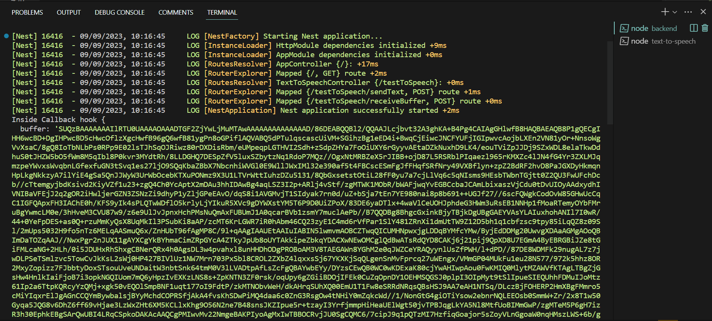

# Automação com reconhecimento por voz.

- Nome do Projeto: Sherlock;
- Nome do Parceiro: IBM;
- Nome do Grupo: Holmes;
- Integrantes do grupo: Beatriz Hirasaki Leite, Felipe Gomes, Gabriel Rios Torres, João Lucas Delistoianov Gonzalez, Luiz Felipe Kama Alencar, Marcos Vinicius Alves de Moura, Sophia de Oliveira Tosar.

**Conteúdo**

- [Testes](#Testes)

# Testes

## API para implementar a etapa de Speech to Text: 

Teste no Postman:

Testando URL principal do serviço. Endpoint - Post para usar o serviço:

Obtendo URL de transcrição de audio em português. Endpoint - Get para pegar URL em portugues:

End point do speech to text com transcrição de audio em português. Endpoint - Post para usar o speech_to_text em português:

## API para receber os áudios enviados pelo usuário:

## Algoritmo de NLP utilizado e sua implementação:

A avaliação de algoritimos de Processamento de Linguagem natural é uma etapa crítica no desenvolvimento de modelos de linguagem e algoritmos de NLP. Dois componentes fundamentais desses testes são a tokenização e tratamento de stop words. 
Os testes de tokenização visam avaliar a capacidade do algoritmo em dividir corretamente o texto em unidades significativas. Isso é crucial para a análise textual e de sentimentos.
Por outro lado, os testes de stop words concentram-se em determinar a eficácia do algoritmo em identificar e remover as palavras comuns que não contribuem para a compreensão do conteúdo. 

### Tokenização 

### StopWords

>>>>>>> Stashed changes

End point da API speech to text no nosso backend. Endpoint - Post para usar a API:

## Integração do Backend ao Serviços

### Backend enviando o texto para o text to speech

Na imagem abaixo é passado o texto que se deseja transformar em audio no corpo da requisição, para ser enviado até a api de text to speech.

### API do serviço de text to speech recebendo o texto

Na imagem abaixo a api de text to speech recebe o texto vindo do backend.

### API do serviço de text to speech transformando o texto em base 64

A imagem abaixo mostra a mensagem "bom dia grupo" transformada em base 64.

### API do serviço de text to speech enviando o base 64 para o backend

A imagem abaixo mostra o terminal do backend recebendo a base 64 vindo do serviço de text to speech.

